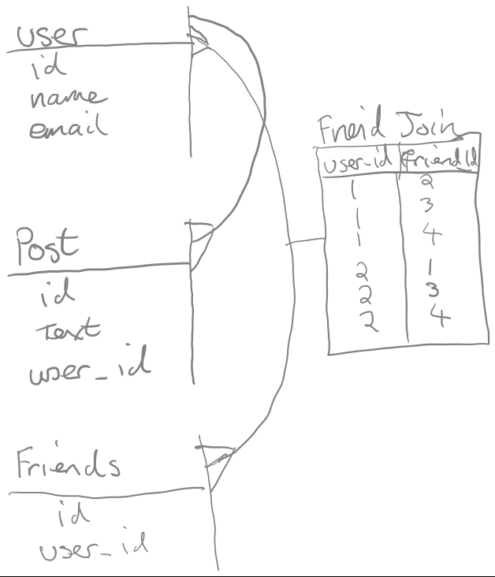

#Interview Prep

(Partially from https://github.com/h5bp/Front-end-Developer-Interview-Questions)

Go through all of the following questions and think about how you would respond to each. You should be able to answer many of the questions from memory, but you may have to research a few of them.

**Copy this md file to your homework folder and add a short answer under each item.** You should try to be as concise as possible, and list any handy resources you used to answer the question. This will be useful for studying for interviews after class.

## General Questions

* What did you learn yesterday/this week?
	
	I learned how to write a web server using Node.js and aquiring only $http.

* What excites or interests you about coding?

	Problem solving is a strength and a passion for me and creating something tangable from scratch is such a reward.	

* What is a recent technical challenge you experienced and how did you solve it?

	I used Node.js to create a webserver that generated two paths and send some HTML code to the screen with out using express and only requiring http. To solve this I had to consult Node.js documentation. I also searched stack overflow but foudn that the documentation was the best source for an explanation of how to set a url path in Node.

* What UI, Security, Performance, SEO, Maintainability or Technology considerations do you make while building a web application or site?
	
	As a general example, when I build a website the UI is designed to be mobile responsive and intuitive to navigate. Security is important so where API's are used the keys are kept in .env files to prevent them from being pushed to github or Heroku. Passwords are encrypted with something like bcrypt before being stored in databases. Performance of larger applications can be optimized by reducing lines of code and in the case of ruby ensuring the use of single quotes as double quotes will perform a string interpolation function. Removing commented out code, keeping code descriptive comments conceise and removing spaces between lines will also help. Lastly making sure your code is not repetative or 'DRY' will reduce the time taken to execute code. Comenting code is also important for maintainability, allowing you or other developers to understand what the code is doing quickly. Using GitHub consistantly and often also allows the history of the project to seen and helps diagnosing issues. Considering other factors also like when it's appropriate to use ingeritance or not will help to style the code in such a way that its both easy to maintain and understand.

* Talk about your preferred development environment.
	
	I prefer using Angular with Node and Express, coding using sublime, Chrome's web dev tools and using Linux to host it all.

* Which version control systems are you familiar with?

	GitHub

* Can you describe your workflow when you create a web page?

	There are some differences depending on the type of language or frameworks being used, but in general, i would create an ERD to map out the database (assuming I need one), create user stories and wireframe out what is needed for the site. Then I would move to the terminal. I'd create a drirectory and then run some set up commands to initialte a git repositry. After that running some software initializing commands like npm init for node, setting up the files i need in their respective folders and then opening sublime to start work. If im working in a team and Im a git master I would create a repositry to send out to my team members. Once im setup I will create the web server and routes, controllers and models first, set up the database and once the backend is working begin construction of the views, and finally once I have a working site I will style it with CSS and tools like bootstrap.

* If you have 5 different stylesheets, how would you best integrate them into the site?

	using one folder to contain them, link each to the main index file and then use each one for a specific view. Having multiple files like this also makes team work easier by minimizing merge conflicts.

* Can you describe the difference between progressive enhancement and graceful degradation?

	Greceful degredation is where if one implimented style or layout is incompatible with a browser like an older version of IE, or it's some newer component that's not been widely adopted, when it fails to render a backup font or layout or style takes over in it's place. Another example might be a slide animation not functioning in one browser but the menu continuing to work without the animation. Basically you dont want to reduce functionality of a site just becuase style effects dont work as expected. Progresssive enhancment is similar but instead of falling back to other styles if one fails to render, the site is designed using universal styles and more enhanced styles are applyed when the brower is capable of rendering them.

* Describe how you would create a simple slideshow page, without any frameworks (HTML/CSS/JS only).

	I would use a div to host the images. I would use the timer function to add a class that would hide and show the various images in the div so only one is present at a time and have them rotate. I would control the size and position of hte images using CSS.

* If you could master one technology this year, what would it be?

	D3 because it has a lot of excellent functionality and although complex it can represent data in very intuitive ways. I think D3 elements have some great examples of intelligent and intuitive UI 

* Explain the importance of standards and standards bodies.

	With out these the web would be fragmented and it would be almost inmpossible to create applications and sites that ran everywhere. With out standards it would be nearly impossible to create new frameworks or to advance the state of things in web tech. It also helps to rally people round things like security to ensure users have the same levels of protection everywhere and to address deaper security flaws across the board. 

## HTML Questions

* What does a `doctype` do?
	
	Doctype declares to the browser which version of HTML is being used

* What's the difference between HTML and XHTML?

	xhtml is html written to conform to xml standards. The reason for this was to place stricter controls on html code layout to make it easier for browsers to process the code and create the same results across all browsers. 

* What are `data-` attributes good for?

	The data- attributes gives us the ability to embed custom data attributes on all HTML elements allowing for custom private page or application data.

* Describe the difference between a `cookie`, `sessionStorage` and `localStorage`.

	A cookie will track where you go on the internet and is used to market relevant ads to a user based on their search data and which sites or products they have clicked on. Local storage is data stored locally by the browser so that when a page refresh occurs the data can be accessed by the web application when the hosting site's data is lost. Session storage is storage that holds data during a user session and is deleted when the session ends. This might be loggin in to online banking or other online temporary sessions.

* Why is it generally a good idea to position CSS `<link>`s between `<head></head>` and JS `<script>`s just before `</body>`? Do you know any exceptions?

	CSS links are placed here so that the CSS will load before the page renders allowing for a more seamless page render. Script tags are placed at the bottom because they need to run after the page has loaded. 


## CSS Questions

* What is the difference between classes and IDs in CSS?

	classes can be applied to many elements in order to style them all in the same way. ID's can only be applied to one element.

* What's the difference between "resetting" and "normalizing" CSS? Which would you choose, and why?

	Normalize.css preserves useful defaults rather than "unstyling" everything. 

* Describe Floats and how they work.

	floats are floating point numbers and allow an application to perform more precise mathematics than using integers alone.

* Describe z-index and how stacking context is formed.

	A float is a box that is shifted to the left or right on the current line. The most interesting characteristic of a float (or “floated” or “floating” box) is that content may flow along its side (or be prohibited from doing so by the “clear” property). Content flows down the right side of a left-floated box and down the left side of a right-floated box.

* Have you ever used a grid system, and if so, what do you prefer?

	I havent used a grid system before but I have used column from bootstrap to layout content in a specific way.

* Have you used or implemented media queries or mobile specific layouts/CSS?

	Yes, media queries are the main way I control the layout for smaller screens such as phone's in order to ensure a good experience across devices.

* How do you optimize your webpages for print?

	you would add the attribute media='print' to teh style sheet link of the page you wish to make print ready.

* What are the advantages/disadvantages of using CSS preprocessors?

	CSS preprocessors take code written in the preprocessed language like SASS and then convert that code into regular css. Advantages are they often allow for an increased level of functionality and make it easier to do complex things with CSS. A disadvantage might be that the style of the code is different from regular CSS making it harder to mix with traditional CSS. In addition everyone on the team needs to use the same preprocessor

  * Describe what you like and dislike about the CSS preprocessors you have used.

	I have used SCSS and I felt it was less intuitive than straight CSS. It was however more efficient code wise and provided benefits not available to CSS.

* How would you implement a web design comp that uses non-standard fonts?

	I would try to find the same fonts on a service like google fonts. If none were available then I would include the font file in the code directory and access it just like any other file. The file would be packaged with the site so it was accessible on other machines on the internet.

* Explain how a browser determines what elements match a CSS selector.

	browsers read your CSS selectors  from right to left. That means that in the selector ul > li a[title=”home”] the first thing thing interpreted is a[title=”home”]. This first part is also referred to as the “key selector” in that ultimately, it is the element being selected.

* Explain your understanding of the box model and how you would tell the browser in CSS to render your layout in different box models.

	A box model refers to the padding, margin and border of an element. By controlling each you can add padding to the inside of the element, increase the space outside of the element by increasing it's margin or increase the border of the element.

* What does ```* { box-sizing: border-box; }``` do? What are its advantages?

	The box-sizing property is used to alter the default CSS box model used to calculate width and height of the elements. It is possible to use this property to emulate the behavior of browsers that do not correctly support the CSS box model specification.

* List as many values for the display property that you can remember.

	inline, block, inline-block flex, grid, none, table

* What's the difference between inline and inline-block?

	The inline element generates inline elements, the inline-block element generates a block element box which will have other content flow around it.

* What's the difference between a relative, fixed, absolute and statically positioned element?

	Static - keeps the element in it's current position,
	relative - lays out all elements as though the element were not positioned,
	absolute - Do not leave space for the element. Instead, position it at a specified position relative to its closest positioned ancestor or to the containing block
	fixed - Do not leave space for the element. Instead, position it at a specified position relative to the screen's viewport and don't move it when scrolled.

* The 'C' in CSS stands for Cascading.  How is priority determined in assigning styles (a few examples)?  How can you use this system to your advantage?

	the styling order in CSS is determined as first come first served. A later styling change will over ride a class effect if it comes after the class in the css file. This allows wide spread styling to be over written for a single element (like changing it's color) or when a condition is met.

* What existing CSS frameworks have you used locally, or in production? How would you change/improve them?

	boot strap and materialize, in both cases I would make it easier to override the CSS making them more customizable.

* Have you played around with the new CSS Flexbox or Grid specs?

	Flex box, yes. I used flex box to lay out my portfolio page and learning to use it by playing flex box froggy.

* Have you ever worked with retina graphics? If so, when and what techniques did you use?

	no but I am aware of it as a tool to swap out pictures for higher resolution pictures when a retina screen is detected.

* Explain some of the pros and cons for CSS animations versus JavaScript animations.

	CSS animations are good low resource methods of implimenting simple animations like a menu transition. JavaScript annimations are more intensive but can do more and should be used when you have a more complex application animation like a card flip

## JS Questions

* Explain event delegation

	DOM event delegation is a mechanism of responding to ui-events via a single common parent rather than each child, through the magic of event "bubbling" (aka event propagation).

* Explain how `this` works in JavaScript

	The event is dispatched to its target EventTarget and any event listeners found there are triggered. Bubbling events will then trigger any additional event listeners found by following the EventTarget's parent chain upward, checking for any event listeners registered on each successive EventTarget. This upward propagation will continue up to and including the Document.

* Explain how prototypal inheritance works

	prototypal inheritance is when an object inherits from another object. This differs from classical inheritance, in which a class inherits from another class.

* Why is it called a Ternary expression, what does the word "Ternary" indicate?

	There are three parts to the expression, hence ternary. do this if true else false.

* What's the difference between a variable that is: `null`, `undefined` or `undeclared`?

	null - declared variable has no value,
	undefined - variable has no data type associated with it,
	undeclared - variable is used but not defined.

  * How would you go about checking for any of these states?

	we could use an if statements to check for a null etc	
	
* What is a closure, and how/why would you use one?

	closures and functions within a function. these closures can use their own local variables so when programming in a team using closures stops the repetition of variable names.

* What's a typical use case for anonymous functions?

	to run a function once and 'throw it away' afterwards. 

* Difference between: `function Person(){}`, `var person = Person()`, and `var person = new Person()`?

	the first one creates a function called Person, the second sets a variable person to eqal the function Person and the last one creates a new instance of a class called Person.

* What's the difference between `.call` and `.apply`?

	The difference is that apply lets you invoke the function with arguments as an array; call requires the parameters be listed explicitly.

* Explain `Function.prototype.bind`.

	The bind() method creates a new function that, when called, has its this keyword set to the provided value, with a given sequence of arguments preceding any provided when the new function is called.

* What's the difference between feature detection, feature inference, and using the User Agent string?

	Feature detection is attempting to determine if a feature exists. Feature inference is assuming that because you've detected one feature that you can use other features. User agent string is just reading the string that each browser sends along and then you can compare that string with some known browsers you're targeting

* Explain AJAX in as much detail as possible.

	Ajax is a set of web development techniques using many web technologies on the client-side to create asynchronous Web applications. With Ajax, web applications can send data to and retrieve from a server asynchronously (in the background) without interfering with the display and behavior of the existing page. By decoupling the data interchange layer from the presentation layer, Ajax allows for web pages, and by extension web applications, to change content dynamically without the need to reload the entire page. Despite the name, the use of XML is not required (JSON is often used in the AJAJ variant), and the requests do not need to be asynchronous.

* Have you ever used JavaScript templating?

	Yes, it's used in Angular. Templating becomes useful when the information distributed may change, is too large to be maintained in various HTML pages by available human resources and not large enough to require heavier server-side templating.

  * If so, what libraries have you used?

	Angular, and React

* Explain "hoisting".

	Hoisting is JavaScript's default behavior of moving all declarations to the top of the current scope (to the top of the current script or the current function).

* Describe event bubbling.

	Event bubbling is where the event is first captured and handled by the innermost element and then propagated to outer elements

* What's the difference between an "attribute" and a "property"?

	Attribute is a quality or object that we attribute to something. Property is a quality that exists without any attribution. 

* Why is extending built-in JavaScript objects not a good idea?

	it isnt part of any spec. host objects have no rules, there is a chance of collisions with other properties, performance is reduced.

* What is the difference between `==` and `===`?

	== checks the value, === checks the data type.

* Explain the same-origin policy with regards to JavaScript.

	The “Same Origin” policy limits the access of one window to another. The reason behind that is security. If you have blabla.com in one window and gmail.com in another one, then you’d not want a script from blabla.com to access or modify your mail or run actions in context of gmail on your behalf.

* What is the extent of your experience with Promises and/or their polyfills?

	Promises can be changed together to process after the previous process has finished, and if it doenst finish the chained promis wont run.

* What are the pros and cons of using Promises instead of callbacks?

	promises have error checks baked in.

* What tools and techniques do you use debugging Javascript code?

	console.log, chrome dev tools (breakpoints). 

* What language constructions do you use for iterating over object properties and array items?

	conditional loop statements, like for, for in, until or while.

## Database Questions

* Design a database schema for Facebook, with at least 4 models, a complete set of attributes for each model, a 1:M association, and a M:M association.

	

## Ruby/Rails
* What are ruby gems?

	Gems are the packages for Ruby

* What is the difference between a symbol and a string?

	a symbol has one occurence in memory, a string can be repeated.

* What is the difference between a class method and an instance method?

	Class methods are methods that are called on a class and instance methods are methods that are called on an instance of a class.

* What is the difference between local variables, instance variables, and class variables?

	local variables are accessible from the current environment like a function but not from outside that environment. instance variables are accessable anywhere with in the instance, including between functions with in that instance. Class variables are accessable anywhere within the class

* What is a range?

	a range is a short hand way of counting through a range eg (1..100) counts 1 to 100

* In ruby, what does attr_accessor do?  

	it sets the accessability property of a symbol variable, like read only, write only or both

* What is the purpose of environment files under the config folder in Rails? (development, test, production)

	these let you run gems of have other setings specific to testing that would wouldnt want in the production version of the app.

* What is the purpose of the application.rb file in Rails?

	It sets up the application as a ruby application

* How can you define a constant?

	A constant has a name starting with an uppercase character. It should be assigned a value at most once. Reassignment of a constant generates a warning but not an error

* What is the purpose of `yield`?

	Yield lets you branch from within a method and execute some external code, then return to the original code in the first method.

* How do you store API keys when creating an app?

	in an .env file and represend the data as variables

* How do I send parameters through a url?

	by using an object with a set of simple name value pairs

* Explain MVC

	Model, View, Controller, this is the technique of seperating out code in to models, controllers and views in order to manage the code easier and make faster to find teh code you need.

* What is a `before_action`? When would you use it?

	its an action that occurs before some other process. you would use it to encrypt a password before you sent it to a database.

* What do controllers do in rails?

	the Controller fetches objects from the database using the Model and then hands them to the View to be rendered.

* What is RESTful routing?

	RESTful routes are the default routes in Rails. REST provides a way of communication inside your application and all requests that exist from external sources (just as a browser request).

* What is a polymorphic association?

	Polymorphic associations allow us to associate a single attribute of the class to any number of specified classes

* What are params?

	The params come from the user's browser when they request the page. For an HTTP GET request, which is the most common, the params are encoded in the url. For example, if a user's browser requested

* How do I make a migration to add a column in Rails?

	rails generate migration add_column users:string

* What is CSRF? How does Rails protect an app against this?

	Cross Site Request Forgery - This attack method works by including malicious code or a link in a page that accesses a web application that the user is believed to have authenticated. If the session for that web application has not timed out, an attacker may execute unauthorized commands. To protect against forged requests, we use a security token that our site knows but other sites don't know. We include the security token in requests and verify it on the server. This is a one-liner in your application controller, and is the default for newly created rails applications:

protect_from_forgery with: :exception


* What's the difference between `User.find_by_id(1)` and `User.find(1)`?

	find the user with id 1 vs find the first user

* What's are classes in Ruby? What are modules? And what's the difference?

	A module cannot be instantiated. When a class includes a module, a proxy superclass is generated that provides access to all the module methods as well as the class methods. A module can be included by multiple classes. Modules cannot be inherited


## Testing Questions

* What are some advantages/disadvantages to testing your code?

	Takes longer to create the project, often the testing code will be longer than the application code. It does however lead to better written code in the application.

* What tools would you use to test your code's functionality?

	TDD

* What is the difference between a unit test and a functional/integration test?

	Unit testing would be testing units in isolation, Integration testing will be combining the units of a module and testing in accordance with each other.

* What is the purpose of a code style linting tool?
	
	Linting is the process of running a program that will analyse code for potential errors.
	
* What is End-to-end (E2E) testing? How can it be implemented in frameworks like Angular and Rails?

	End-to-end testing is a methodology used to test whether the flow of an application is performing as designed from start to finish. The purpose of carrying out end-to-end tests is to identify system dependencies and to ensure that the right information is passed between various system components and systems. It can be done in Angular using Protractor.

## Coding Questions:

*Question: What is the value of `foo`?*
```javascript
var foo = 10 + '20';
```
'1020'

*Question: How would you make this work?*
```javascript
add(2, 5); // 7
add(2)(5); // 7

function add (num1, num2){
	return result = num1 + num2;
} 

function add (num1) {
	return function(num2) {
		return num1 + num2;	
	};
}
```

*Question: What value is returned from the following statement?*
```javascript
"i'm a lasagna hog".split("").reverse().join("");

goh angasal a m'i
```

*Question: What is the outcome of the two alerts below?*
```javascript
var foo = "Hello";
(function() {
  var bar = " World";
  alert(foo + bar);
})();
alert(foo + bar);

"Hello World"
error, bar undefined
```

*Question: What is the value of `foo.length`?*
```javascript
var foo = [];
foo.push(1);
foo.push(2);

length of 2
```

*Question: What is the value of `foo.x`?*
```javascript
var foo = {n: 1};
var bar = foo;
foo.x = foo = {n: 2};

undefined
```

*Question: What does the following code print?*
```javascript
console.log('one');
setTimeout(function() {
  console.log('two');
}, 0);
console.log('three');

one
three
two
```

## Fun Questions:

* What's a cool project that you've recently worked on?

	datascraping a website to create a whisky database and allowing users to share tags between each other to group learn about them.

* What are some things you like about the developer tools you use?

	I like how customizable they are.

* Do you have any pet projects? What kind?

	Building a new website for my wife's dental practice, using a rasberry pie to build a wifi hotspot.

* How do you like your coffee?

	Black with 2 spoonfulls of hot chocolate powder
